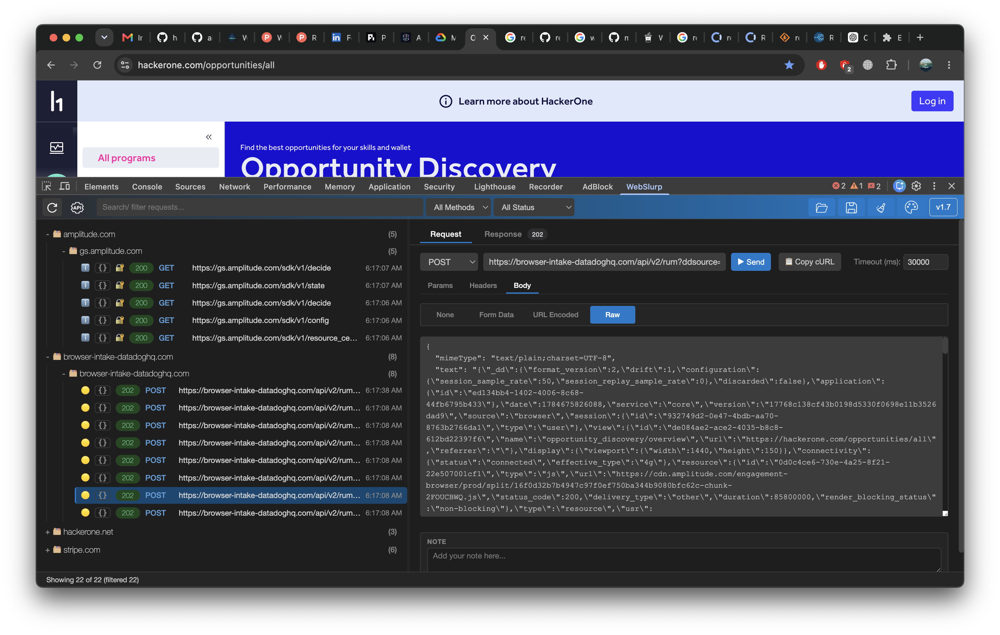
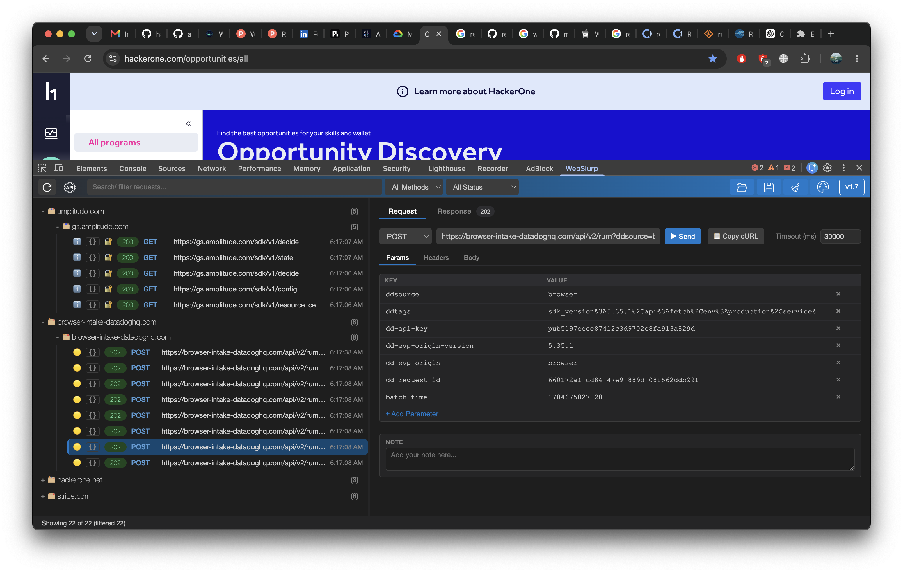
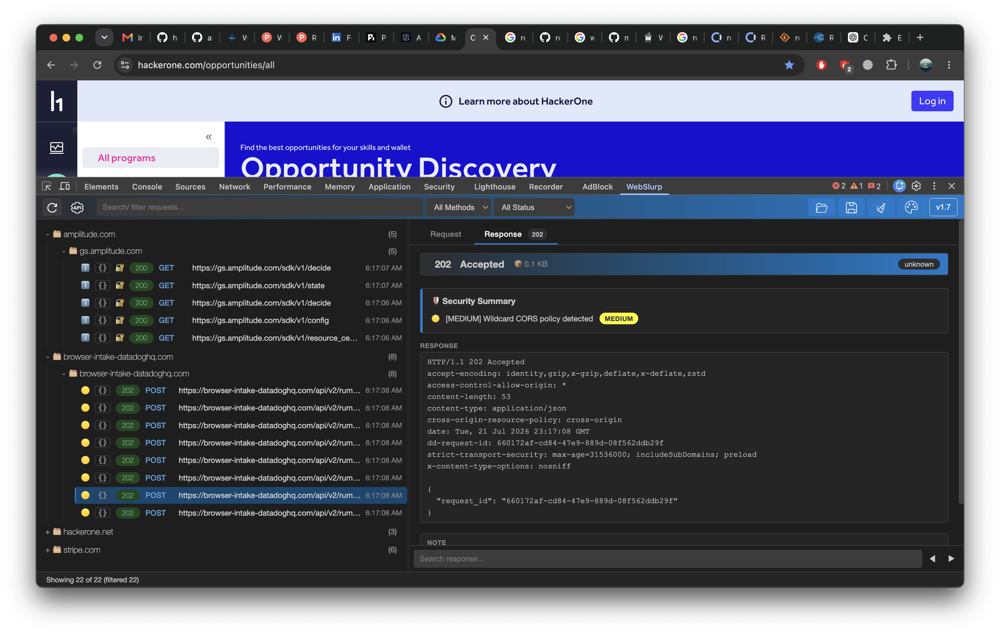

<p align="center">
  
</p>

# WebSlurp


**Capture. Edit. Replay. Right inside Chrome DevTools.**

WebSlurp lets you capture network requests directly from Chrome DevTools, edit them, and replay them instantly — no proxy setup, no switching between tools.

It's the fastest way to inspect and replay HTTP requests when testing web applications and APIs.

Think **Burp-style request replay with a Postman-like interface**, built right into your browser.







[](https://github.com/user-attachments/assets/74166d33-ee1f-4667-89a6-1c98f8ec1886)

## Features

* Capture API requests or all URLs
* Edit methods, parameters, headers, and request bodies
* Replay requests instantly
* Filter by keyword, request method, or response status
* Custom capture filters to skip images, CSS, and other static resources
* Search inside response bodies
* Copy requests as cURL
* Save your work to a file
* 18 light and dark themes

## A Shorter Workflow

| Postman                     | Burp Suite          | WebSlurp           |
| --------------------------- | ------------------- | -------------------- |
| Open browser                | Open browser        | Open browser         |
| Inspect Network → XHR/Fetch | Open Burp Suite     | Inspect → WebSlurp |
| Copy request data           | Capture / intercept | Edit request         |
| Open Postman                | Edit request        | Send request         |
| Build / import request      | Send request        |                      |
| Edit request                |                     |                      |
| Send request                |                     |                      |

WebSlurp keeps the workflow where the request already happens: **inside your browser**.

## Try It

Install WebSlurp, open Chrome DevTools, and start capturing.

## Installation

1. Clone the repository

    ```bash
    git clone https://github.com/hangga/webslurp.git
    ```

2. Open Chrome Extensions → Developer Mode (Enable)
   <p align="left">
    
   </p>
3. Click Load unpacked. 
4. Select the **webslurp** directory.

A new **WebSlurp** tab will appear.

<p align="center">
Made with ❤️ by <a href="https://hangga.web.id/">Hangga Aji Sayekti</a>
</p>