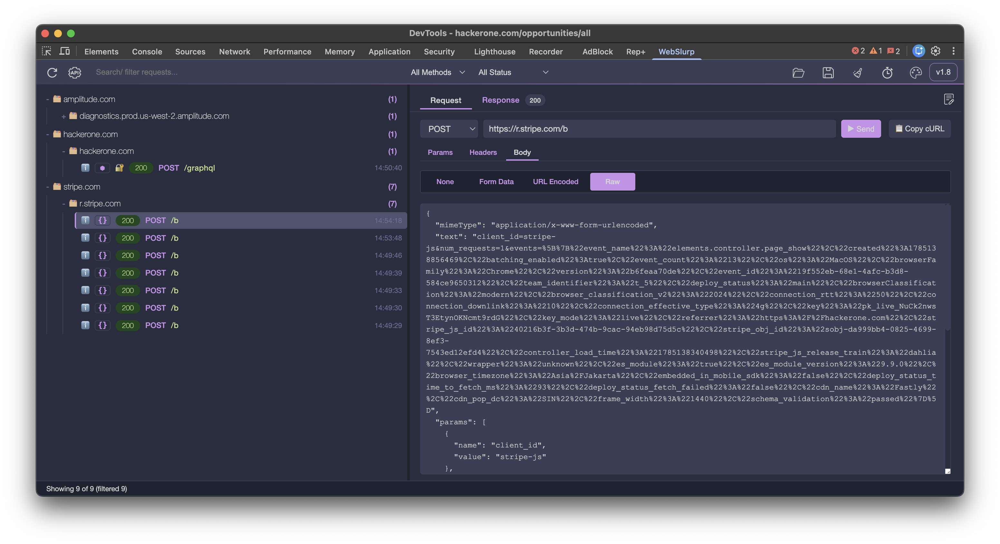
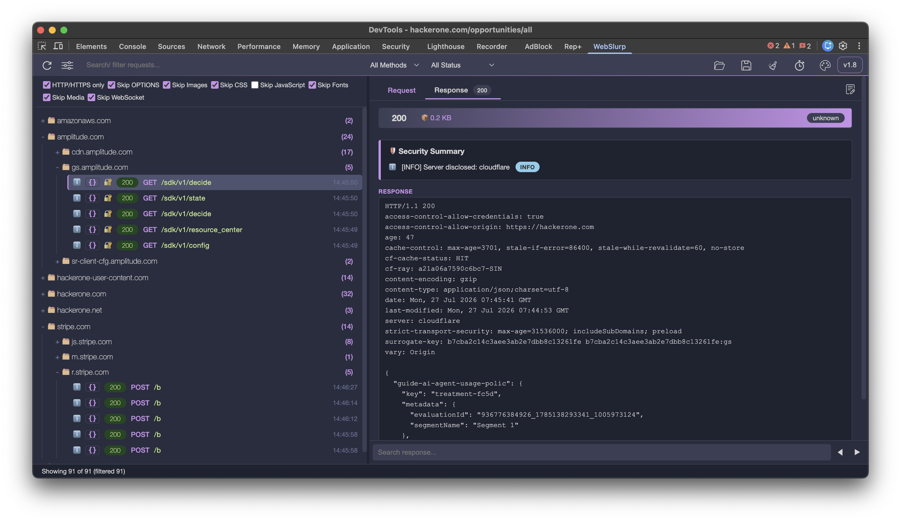
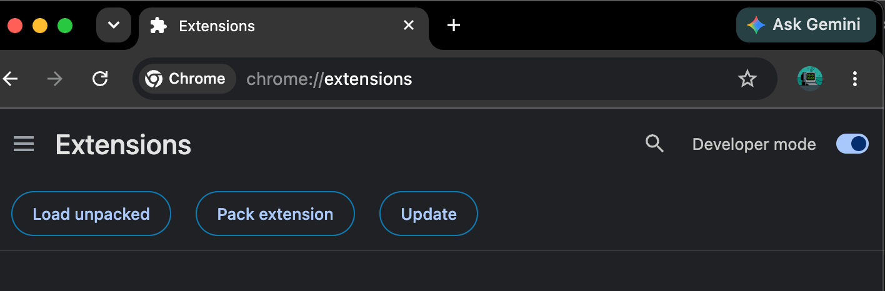

<p align="center">
  
</p>

# WebSlurp


**Capture. Analyze. Edit. Replay. Right inside Chrome DevTools.**

WebSlurp lets you capture network requests directly from Chrome DevTools, analyze them for potential security testing opportunities, edit them, and replay them instantly — no proxy setup, no switching between tools.

It's the fastest way to inspect, analyze, and replay HTTP requests when testing web applications and APIs.

Think **Burp-style request replay with built-in API security analysis**, right inside your browser.





[](https://github.com/user-attachments/assets/74166d33-ee1f-4667-89a6-1c98f8ec1886)

## ✨ Features

* **Capture API requests or all URLs**
  Automatically intercept HTTP/HTTPS traffic from the inspected page, with smart filtering to focus on API calls or all resources.

* **Edit methods, parameters, headers, and request bodies**
  Modify any aspect of a captured request before replaying it.

* **Replay requests instantly**
  Send edited requests directly from DevTools and inspect the response immediately.

* **Potential IDOR Analysis** *(new in v1.10)*
  Automatically analyze captured requests and highlight URL path segments or query parameters that may represent user-controlled object identifiers. Useful for finding endpoints worth investigating for IDOR vulnerabilities—even when identifiers are not obvious.

* **Race Test** *(new in v1.10)*
  Replay multiple concurrent requests with a single click to evaluate whether an endpoint may be susceptible to race condition vulnerabilities.

* **Attack Surface Analysis**
  Evaluate authorization and business logic attack surface for every captured request with actionable indicators.

* **Filter by keyword, request method, or response status**

* **Custom capture filters**
  Ignore images, CSS, JavaScript, fonts, media, WebSocket, and OPTIONS requests.

* **Add Notes**
  Annotate requests during your testing workflow.

* **Search inside response**

* **Copy requests as cURL**

* **Export & Import session logs**

* **18 light and dark themes**

---

## 🛡️ Security Analysis

### Attack Surface Analysis

Every captured request is analyzed to estimate its security testing potential.

WebSlurp evaluates patterns commonly associated with authorization flaws and business logic vulnerabilities, including:

* Object identifiers
* Privileged endpoints
* Ownership references
* Financial operations
* Workflow actions
* Resource manipulation patterns

Each request receives:

* **Authorization Potential Score**
* **Business Logic Potential Score**
* **Actionable Indicators** explaining why the endpoint may deserve further testing.

### Potential IDOR Analysis *(new)*

IDOR vulnerabilities aren't always exposed through obvious endpoints like:

```
GET /users/123
GET /profile?userId=42
```

Modern applications often embed identifiers inside nested paths, encoded values, slugs, hashes, or non-obvious parameters.

WebSlurp analyzes captured requests and highlights values that are likely to represent user-controlled object identifiers, helping you quickly identify endpoints worth manually testing for IDOR vulnerabilities.

This feature assists security researchers during reconnaissance—it does **not** determine whether an endpoint is vulnerable.

### Race Test *(new)*

Race conditions are often difficult to reproduce manually.

WebSlurp can replay multiple concurrent requests against the same endpoint, making it easier to evaluate operations that may be affected by timing issues, such as:

* Double spending
* Duplicate coupon redemption
* Multiple purchases
* Inventory inconsistencies
* Concurrent state changes

Race Test helps identify endpoints that deserve further investigation without leaving Chrome DevTools.

## A Shorter Workflow

| Postman                     | Burp Suite      | WebSlurp           |
| --------------------------- | --------------- | ------------------ |
| Open browser                | Open browser    | Open browser       |
| Inspect Network → XHR/Fetch | Open Burp Suite | Inspect → WebSlurp |
| Copy request                | Capture traffic | Capture traffic    |
| Open Postman                | Edit request    | Security analysis  |
| Build request               | Send request    | Edit request       |
| Send request                |                 | Replay / Race Test |

WebSlurp keeps the entire workflow where the request already happens: **inside your browser**.

## Try It

Install WebSlurp, open Chrome DevTools, and start capturing.

## Installation

1. Clone the repository

```bash
git clone https://github.com/hangga/webslurp.git
```

2. Open **Chrome Extensions** → Enable **Developer Mode**

<p align="left">

</p>

3. Click **Load unpacked**

4. Select the **webslurp** directory.

A new **WebSlurp** tab will appear inside Chrome DevTools.

<p align="center">
Made with ❤️ by <a href="https://hangga.web.id/">Hangga Aji Sayekti</a>
</p>
